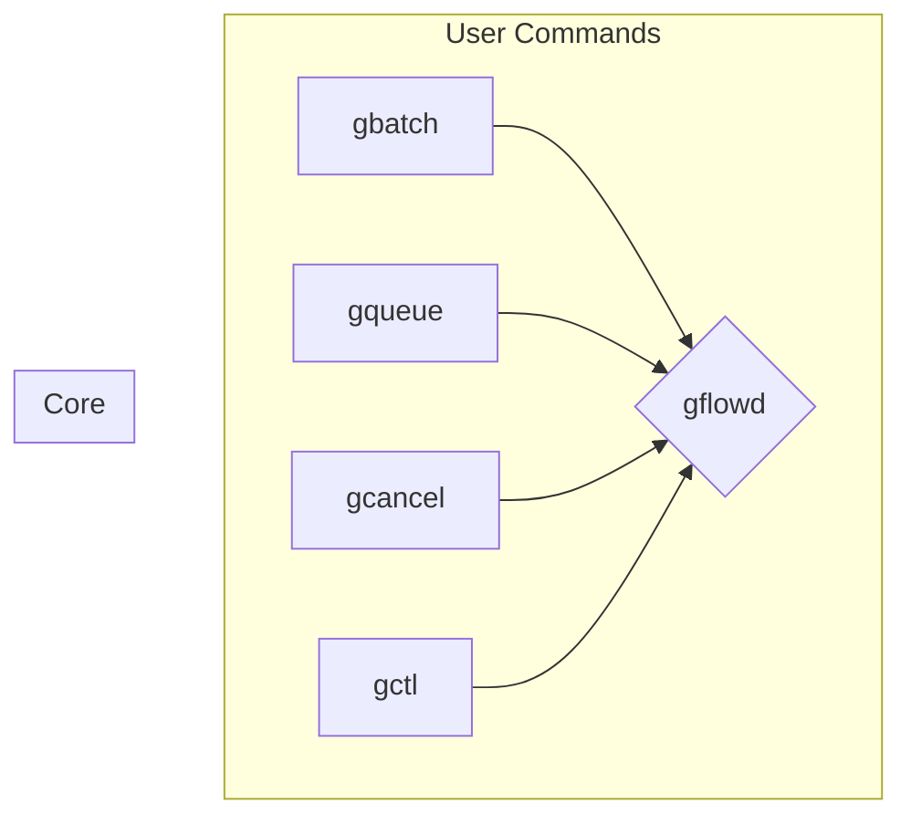

# gflow Binary Refactoring Design

This document outlines the plan to refactor `gflow` into multiple binaries, inspired by the design of Slurm.

## New Binary Structure

The `gflow` project will be split into the following binaries:

- **`gflowd`**: The core daemon responsible for job scheduling and execution. This remains the central component.
- **`gbatch`**: The core client for submitting (`add`) and creating (`new`) jobs. Inspired by `sbatch`.
- **`gqueue`**: Queries the job queue (replaces `gflow list`). Inspired by `squeue`.
- **`gcancel`**: Cancels jobs and manages job states (internal use).
- **`gctl`**: Manages the daemon and displays system information (replaces `gflow daemon` and `ginfo`). Inspired by `scontrol`/`systemctl`.

## Architecture Diagram

## Implementation Plan

1.  Define the new binaries in `Cargo.toml`.
2.  Create a `main.rs` file for each new binary.
3.  Move the logic from the existing `gflow` subcommands into the corresponding new binaries.
4.  Refactor shared code (like the client and configuration) into the `gflow` library crate to be used by all binaries.
5.  Update the main `gflow` command to either act as a dispatcher or provide documentation for the new commands.
6.  Ensure all binaries compile and all tests pass.
