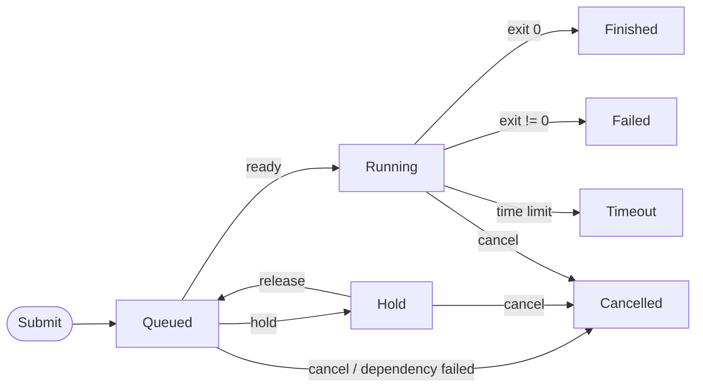

# Job Lifecycle

This guide explains the complete lifecycle of jobs in gflow, including state transitions, status checking, and recovery operations.

## Job States

gflow jobs can be in one of seven states:

| State | Short | Description |
|-------|-------|-------------|
| **Queued** | PD | Job is waiting to run (pending dependencies or resources) |
| **Hold** | H | Job is on hold by user request |
| **Running** | R | Job is currently executing |
| **Finished** | CD | Job completed successfully |
| **Failed** | F | Job terminated with an error |
| **Cancelled** | CA | Job was cancelled by user or system |
| **Timeout** | TO | Job exceeded its time limit |

### State Categories

**Active States** (job is not yet complete):
- Queued, Hold, Running

**Completed States** (job has finished):
- Finished, Failed, Cancelled, Timeout

## State Transition Diagram

The following diagram keeps only the core transitions. Completed states are terminal.



Use the toolbar in the top-right corner to zoom, fit, download, or enter fullscreen.

### State Transition Rules

**From Queued**:
- → **Running**: When dependencies are met AND resources are available
- → **Hold**: User runs `gjob hold <job_id>`
- → **Cancelled**: User runs `gcancel <job_id>` OR a dependency fails (with auto-cancel enabled)

**From Hold**:
- → **Queued**: User runs `gjob release <job_id>`
- → **Cancelled**: User runs `gcancel <job_id>`

**From Running**:
- → **Finished**: Job script/command exits with code 0
- → **Failed**: Job script/command exits with non-zero code
- → **Cancelled**: User runs `gcancel <job_id>`
- → **Timeout**: Job exceeds its time limit (set with `--time`)

**From Completed States**:
- No transitions (final states)
- Use `gjob redo <job_id>` to create a new job with the same parameters

## Automatic Retries

- Set a per-job retry budget with `gbatch --max-retries <N>` or `gjob update <job_id> --max-retries <N>`.
- When a running job exits non-zero, gflow can submit a new queued attempt until that budget is exhausted.
- Queued dependents are retargeted to the newest retry attempt automatically.
- Timeouts and explicit fail requests remain terminal today.
- Manual `gjob redo` stays separate from automatic retry tracking.

## Job State Reasons

Jobs in certain states have an associated reason that provides more context:

| State | Reason | Description |
|-------|--------|-------------|
| Queued | `WaitingForDependency` | Job is waiting for parent jobs to finish |
| Queued | `WaitingForGpu` (`Resources`) | Job is waiting for available GPUs |
| Queued | `WaitingForMemory` (`Resources`) | Job is waiting for available host memory |
| Queued | `WaitingForResources` | Job is waiting for other scheduler-managed resources/limits |
| Hold | `JobHeldUser` | Job was put on hold by user request |
| Cancelled | `CancelledByUser` | User explicitly cancelled the job |
| Cancelled | `DependencyFailed:<job_id>` | Job was auto-cancelled because job `<job_id>` failed |
| Cancelled | `SystemError:<msg>` | Job was cancelled due to a system error |

View the reason with `gjob show <job_id>` or `gqueue -f JOBID,ST,REASON`.

## Status Checking Workflow

The following diagram shows a simplified check -> action -> recheck loop:

```mermaid
---
showToolbar: true
---
flowchart TD
    Check([Run gqueue -f JOBID,ST,REASON]) --> State{State?}

    State -->|Queued| QueuedReason{Reason?}
    QueuedReason -->|WaitingForDependency| Dep[Check parent jobs<br/>gqueue -t]
    QueuedReason -->|WaitingForGpu| GpuRes[Check GPU availability<br/>ginfo]
    QueuedReason -->|WaitingForMemory| MemRes[Check host memory pressure<br/>gqueue --format JOBID,NAME,ST,MEMORY,NODELIST(REASON)]
    QueuedReason -->|WaitingForResources| Res[Check reservations/group limits<br/>ginfo]
    Dep --> Recheck([Recheck later])
    Res --> Recheck

    State -->|Hold| Release[Release job<br/>gjob release ID]
    Release --> Recheck

    State -->|Running| Monitor[Monitor logs or attach<br/>gjob log ID / gjob attach ID]
    Monitor --> Recheck

    State -->|Finished| Done([Done])

    State -->|Failed| Retry[Inspect logs<br/>auto retry may queue next attempt<br/>or redo manually if needed]
    Retry --> Recheck

    State -->|Cancelled| CancelReason{Reason?}
    CancelReason -->|CancelledByUser| Stop([No further action])
    CancelReason -->|DependencyFailed| Cascade[Fix parent and redo<br/>gjob redo PARENT_ID --cascade]
    Cascade --> Recheck

    State -->|Timeout| MoreTime[Redo with more time<br/>gjob redo ID --time HH:MM:SS]
    MoreTime --> Recheck
```

## See Also

- [Job Dependencies](./job-dependencies) - Complete guide to job dependencies
- [Job Submission](./job-submission) - Job submission options
- [Time Limits](./time-limits) - Managing job timeouts
